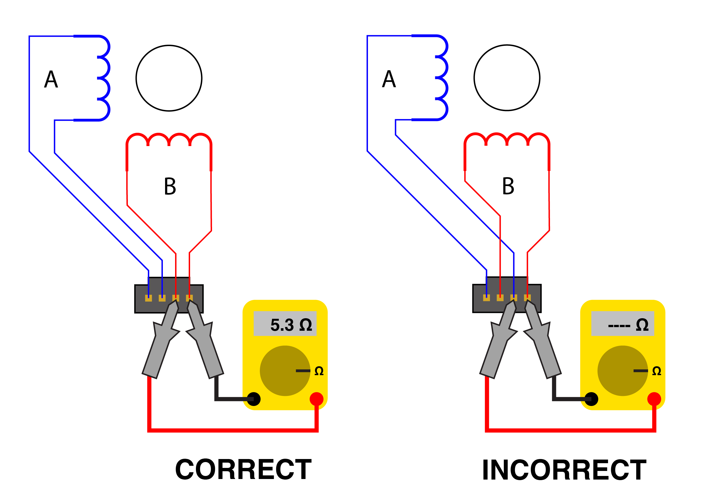
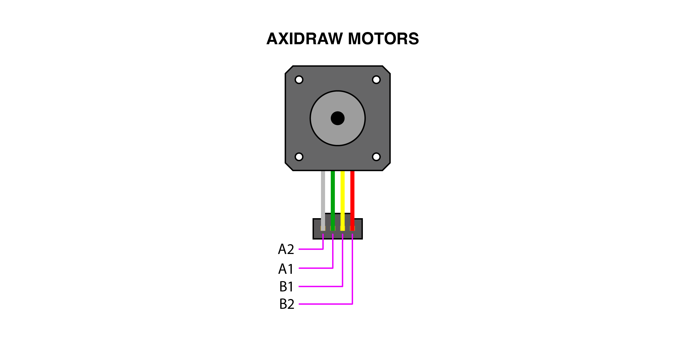
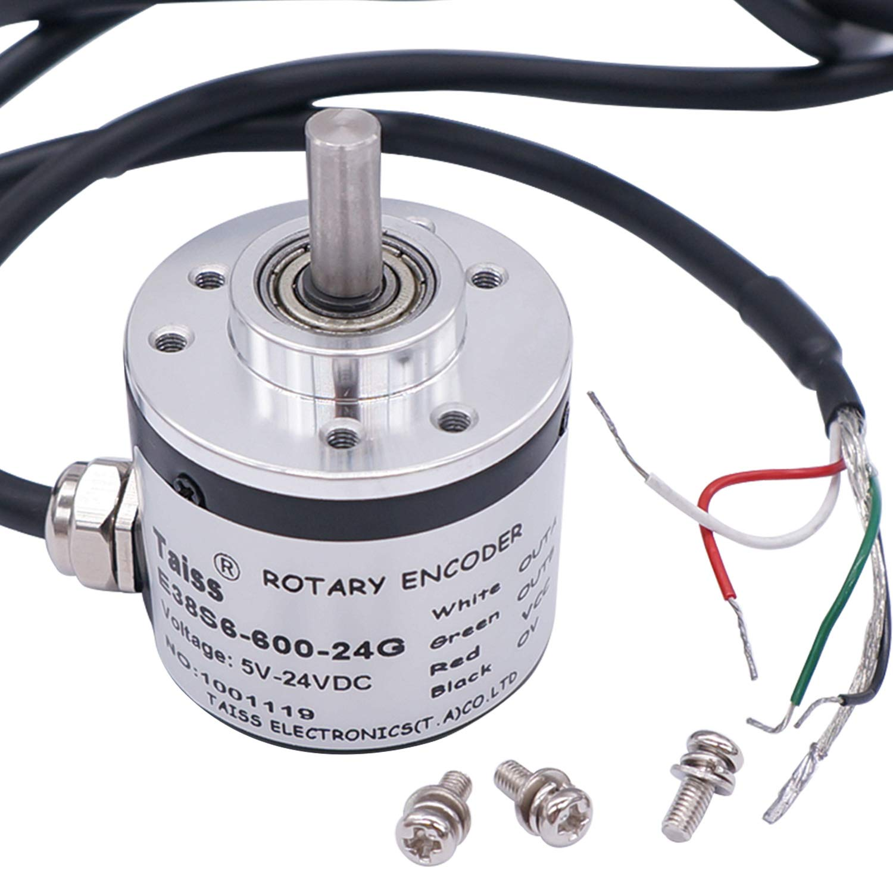
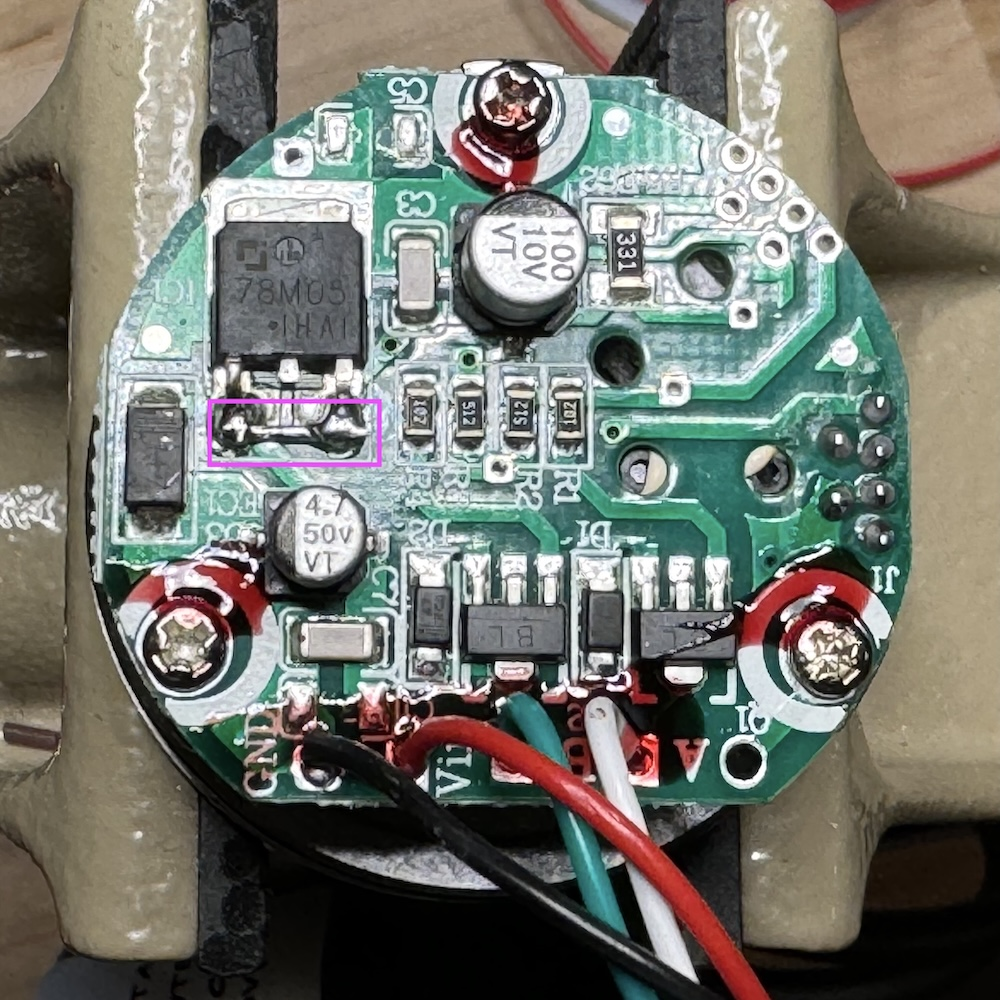
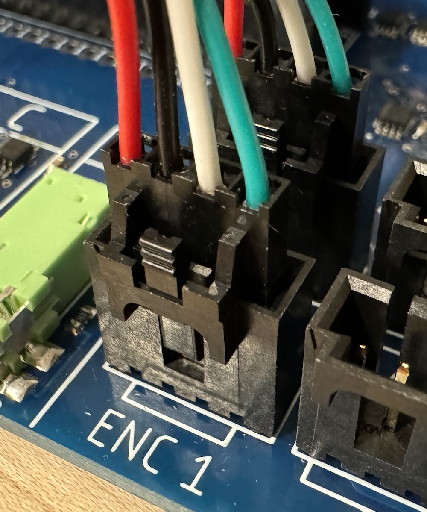
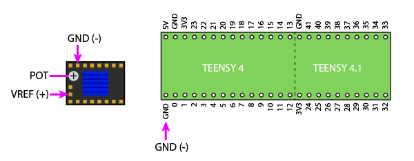

# Wiring devices

## Wiring Stepper Motors

The Stepdance driver board supports _two phase_ stepper motors. These phases "A" and "B" (represented by blue and red inductor symbols in the diagram above) each has two wires coming off the motor, for four leads total. In order for the motor to spin, it is essential that each phase's two wires enter the connector at adjacent pins.

Sometimes you can rely on the stepper motor mfg for the color code, but sometimes you can't, or you don't know the manufacturer. A simple test is to put a multimeter in ohmeter mode across any two of the four motor wires. If you read a low resistance (typically < 20 ohms), these wires belong to the same phase and should be adjacent to each other on the connector. If you read an infinite resistance, try a different combination.

Flipping the two wires within a phase, or flipping the two phases, will change the direction that the motor spins; this can be corrected in software.

Below illustrates the color codes used in the AxiDraw V3.

## Wiring Servo Motor

Note that the servo is wired into the same 4-pin connector and header as the stepper motors.

## Wiring Button

The button should be wired across the INPUT and 3V3 pins of the Molex SL connector, as shown. We will configure the Teensy to apply an internal pull-down resistor to the input pin, which will cause the input to read LOW when not pressed and HIGH when pressed.

## TAISS Optical Encoders

These are a 2400 PPR (600 CPR) optical encoder with bearing supports and a 6mm shaft. They are available from [Amazon](https://www.amazon.com/dp/B07MX1SYXB).

### Modifications
These are designed for input voltages from 7-24V, which are then stepped down to 5V with a 7805 regulator. To get them to run reliably on the 5V supplied by the stepdance module, you'll want to bypass the 7805 by shorting its input to its output.Note that the middle pin should *not* be caught in solder.

### Connector
Here's how to wire the stepdance ENC1/ENC2 connector:

## Setting Motor Driver Currents
Most modern stepper drivers, including the TMC2209s supported by the Stepdance Driver Board, operate using current control. This means that a high voltage (e.g. 24VDC) is used to quickly pump current into the motor coils, and is then cut off once a target current is reached. This allows much higher performance of the motor than a voltage-controlled driver, which needs to operate at a lower voltage in order to avoid over-heating the motor coils. The current control circuitry works by measuring current in each motor coil through a sensing resistor, thereby converting current to voltage, and then comparing this to a reference voltage that sets the current limit. Your mission is to set the  reference voltage on each driver to correspond to the rated motor current.

### Determine the Peak Motor Current
Motors are typically rated in amps/phase, which is a root-mean-square (RMS) value. The current limits on drivers are typically set in peak current by adjusting a reference voltage. First, you should look up the current rating of whichever motors you are using. For an Axidraw V3, this is 1A/phase. Next, convert this value into peak current, by multiplying by 1.414. This is 1.4A for the Axidraw V3.

### Calculate the Reference Voltage

The BIGTREETECH TMC2209 drivers are configured with a gain of 1V/1A, so to calculate the reference voltage, you simply multiply the target peak current by 1.0. For the Axidraw V3, the reference voltage is 1.4V.

### Set the Reference Voltage

Using a multimeter, measure the voltage between VREF and GND as shown in the image, and slowly turn the potentiometer until the reading matches your target voltage. A few important notes:

- To get an accurate reading, the Stepdance Driver Board MUST be powered with both +5V thru the USB port of the Teensy 4.1, AND motor power (e.g. 12V or 24V) thru the DC barrel jack. The BIGTREETECH drivers generate their own reference voltage from the motor power supply. 
- BE VERY CAREFUL when applying the multimeter probes to the VREF and GND pins on the driver. It is very easy to short out the power supply. If you want to play it safe, probe the GND signal at the Teensy 4.1 instead, using the exposed pads below the Teensy 4.1 socket.
